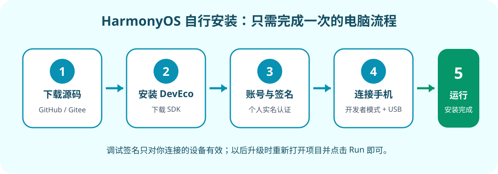

# CareJournal HarmonyOS NEXT 自行安装指南

> 适合无法通过应用市场安装、愿意使用一台 Windows 电脑自行安装的用户。  
> 这不是“一点即装”的公开安装包：HarmonyOS NEXT 不允许未知用户像安装 APK 一样直接侧载公开 HAP。以下方式由你的华为账号为自己的设备生成调试签名，再由 DevEco Studio 安装。



## 开始前准备

- HarmonyOS NEXT 手机或平板，系统至少为 HarmonyOS 6.0（API 20）；
- Windows 10/11 64 位电脑，建议至少 16 GB 内存、100 GB 可用空间；
- 能传输数据的 USB 线；
- 一个已完成**个人开发者实名认证**的华为账号；
- 稳定网络。首次安装 DevEco Studio 和 SDK 会下载较多文件。

如果只想使用软件、不愿安装开发工具，目前请优先使用 Android APK 或 Web 版。

## 1. 注册并实名认证华为账号

1. 打开[华为开发者联盟](https://developer.huawei.com/consumer/cn/)，点击右上角“登录/注册”。已有华为账号可直接登录。
2. 进入管理中心，按页面提示完成个人开发者实名认证。
3. 认证审核通过后再继续。基础真机调试不要求企业开发者账号。

官方说明：[实名认证介绍](https://developer.huawei.com/consumer/cn/doc/start/itrna-0000001076878172)。页面菜单可能随网站更新，以官方当前提示为准。


> 截图占位 1：华为开发者联盟登录入口、管理中心和个人实名认证状态。截图时请遮住姓名、手机号和证件信息。

## 2. 下载并安装 DevEco Studio

1. 打开 [DevEco Studio 官方下载页](https://developer.huawei.com/consumer/cn/deveco-studio/)。
2. 下载 Windows 64 位安装程序，按默认选项安装。
3. 首次启动时同意协议并安装 HarmonyOS SDK、ArkTS SDK 和 Toolchains。模拟器不是本教程必需项。
4. 安装路径和 SDK 路径尽量使用纯英文目录，避免中文路径导致旧版工具异常。

本项目当前按 DevEco Studio 6.1.3、HarmonyOS 6.1.1 / API 24 构建。更高兼容版本通常也可以使用。


> 截图占位 2：官方下载页面、Windows 安装完成页，以及首次启动时的 SDK 组件列表。

## 3. 下载 CareJournal 源码

不熟悉 Git 时使用 ZIP 最简单：

1. 在 [GitHub](https://github.com/wyunchi-ms/CareJournal) 或 [Gitee](https://gitee.com/wyunchi/care-journal) 打开项目主页；
2. 选择下载源码 ZIP；
3. 完整解压到纯英文目录，例如 `C:\CareJournal`。不要直接在 ZIP 压缩包内打开工程。

熟悉 Git 的用户也可以运行：

```powershell
git clone https://github.com/wyunchi-ms/CareJournal.git C:\CareJournal
```

## 4. 使用 DevEco Studio 打开工程

1. 启动 DevEco Studio，选择 **Open**；
2. 选择源码中的 `C:\CareJournal\harmony` 目录，而不是仓库根目录；
3. 等待右下角索引、依赖和 SDK 同步完成；
4. 如提示缺少 SDK，按提示安装 HarmonyOS 6.1.1 / API 24。

如果 IDE 提示网页资源不存在，先在仓库根目录安装 Node.js 20+，然后运行：

```powershell
npm install
npm run harmony:sync
```

再回到 DevEco Studio 重新同步工程。


> 截图占位 3：Open 对话框选中 `CareJournal\harmony`，以及项目加载完成后的目录树。

## 5. 在手机上打开开发者模式

1. 打开 **设置 → 关于手机/关于平板**；
2. 连续快速点击“软件版本”7 次；
3. 按提示确认重启并开启开发者选项；
4. 重启后进入 **设置 → 系统 → 开发者选项**；
5. 打开 **USB 调试**。如果设备另有“应用调试”开关，也一并打开。

官方说明：[开启开发者选项](https://consumer.huawei.com/cn/support/content/zh-cn02842747/)和[打开 USB 调试](https://consumer.huawei.com/cn/support/content/zh-cn16077659/)。不同系统版本的菜单文字可能略有差异。


> 截图占位 4：软件版本、确认重启、开发者选项和 USB 调试开关。截图时请遮住序列号、UDID 等设备标识。

## 6. 连接设备并生成自动调试签名

1. 用 USB 数据线连接手机和电脑；
2. 手机上选择允许 USB 调试，建议勾选“始终允许使用这台计算机”；
3. 在 DevEco Studio 顶部设备列表中确认能看到手机；
4. 打开 **File → Project Structure → Project → Signing Configs**；
5. 勾选 **Automatically generate signature**；
6. 点击 **Sign In**，使用已实名认证的华为账号登录并授权；
7. 等待自动签名完成，点击 **OK**。

自动签名会读取当前设备标识，并生成仅供调试使用的证书和 Profile。签名文件通常保存在当前 Windows 用户目录中，**不要把 `.p12`、密码或 Profile 发给别人，也不要提交到 Git**。

官方说明：[配置应用签名](https://developer.huawei.com/consumer/cn/doc/harmonyos-guides/ide-signing)和[使用本地真机运行应用](https://developer.huawei.com/consumer/cn/doc/harmonyos-guides/ide-run-device)。


> 截图占位 5：Signing Configs 页面、Automatically generate signature、Sign In 和签名成功状态。截图时必须遮住证书路径、账号和设备标识。

## 7. 安装并启动 CareJournal

1. 顶部运行目标选择 `entry`；
2. 设备选择刚连接的手机；
3. 点击绿色三角形 **Run**，或按 `Shift+F10`；
4. 等待构建、签名和安装完成；
5. CareJournal 会在手机上自动启动，并出现在桌面应用列表中。

以后升级源码时，保留手机上的旧版本和同一套本地签名，再次点击 Run 即可覆盖安装。卸载应用会删除其本地数据；升级前建议先在 CareJournal 中导出备份。


> 截图占位 6：顶部设备选择、Run 按钮、构建成功提示，以及手机桌面的 CareJournal 图标。

## 常见问题

### DevEco Studio 看不到手机

- 确认数据线支持数据传输，不是仅充电线；
- 解锁手机并重新允许 USB 调试；
- 只连接一台设备并关闭模拟器；
- 关闭后重新打开 USB 调试，再插拔数据线。

### 提示缺少设备，无法创建 Profile

自动签名需要先识别真机，才能把当前设备加入调试 Profile。先解决 USB 连接，再重新打开 Signing Configs。

### 提示来源不受信任或签名校验失败

- 不要安装 GitHub/Gitee 上旧的 release HAP；
- 删除 DevEco Studio 中旧的自动签名配置，重新登录并生成；
- 若手机上已安装过其他签名的同名应用，先在应用内导出备份，再卸载旧应用并重新 Run。

### 构建时报缺少网页文件

在仓库根目录执行：

```powershell
npm install
npm run harmony:sync
```

随后回到 DevEco Studio 重试。

### 能否把自己生成的 debug HAP 发给其他人？

通常不能。自动调试 Profile 与生成时连接的设备绑定，另一台未知设备无法直接安装。对方需要按本文在自己的电脑和设备上生成自己的调试签名。

## 安全与隐私提醒

- 华为账号密码、签名证书、Profile 和设备 UDID 都属于敏感信息，不要发到 Issue、聊天群或网盘；
- 从源码构建前可核对仓库地址和提交记录；
- CareJournal 数据默认保存在设备本地，但卸载应用通常会删除应用数据；
- 如官方界面与本文截图不同，以本文链接的华为官方文档为准。
